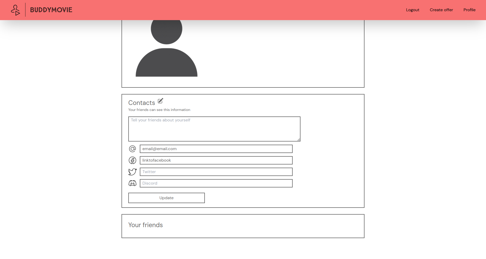

# BuddyMovie

Welcome to BuddyMovie, the platform that bridges the gap between movie lovers, creatingan avenue for unforgettable movie nights and lasting friendships.

## Sign up and login

## Edit your profile

## Create a movie offer

## Rate movies

## Add your new friend


# Setup
Docker compose is used for development purposes
```
docker-compose up --build postgres-database
```
Neon database: https://neon.tech is used for production

# Kubernetes
[How to install minikube and kubectl on Ubuntu](https://www.linuxtechi.com/how-to-install-minikube-on-ubuntu/)

Check if everything was installed correctly
```
minikube version
```
Start a cluster
```
minikube start --driver=docker
```
Creating components
```
kubectl apply -f kubernetes/postgres-config.yaml
```
Get all running podes (worker nodes)
```
kubectl get pod
```
# Jenkins
Run master node and the agent
```
docker-compose up --build jenkins jenkins_agent
```
